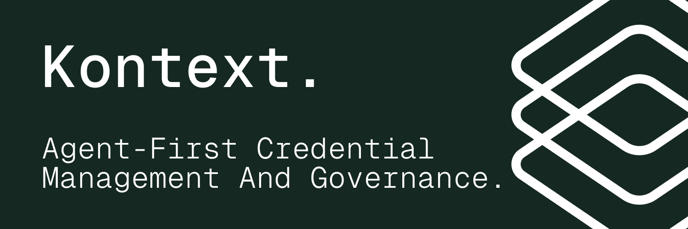

<div align="center">



# Kontext CLI

Store Credentials. Inject At Runtime. Agents Never Store The Keys.

[Website](https://kontext.security) · [Documentation](https://docs.kontext.security/getting-started/welcome) · [Discord](https://discord.gg/gw9UpFUhyY)

</div>

## What is Kontext CLI?

Kontext CLI is an open-source command-line tool that wraps AI coding agents with enterprise-grade identity, credential management, and governance — without changing how developers work.

**Why we built it:** AI coding agents need access to GitHub, Stripe, databases, and dozens of other services. Today, teams copy-paste long-lived API keys into `.env` files and hope for the best. Kontext replaces that with short-lived, scoped credentials that are injected at session start and gone when the session ends. Every tool call is logged. Every secret is accounted for.

**How it works:** On first run, `kontext start` authenticates you, bootstraps the shared Kontext CLI application for your org, creates a local `.env.kontext` file if needed, opens hosted connect for any missing preset providers, exchanges placeholders for short-lived tokens via RFC 8693 token exchange, and launches your agent with those credentials injected. When the session ends, credentials expire automatically.

## Quick Start

```bash
brew install kontext-security/tap/kontext
```

If you prefer a direct binary install, download the latest GitHub Release instead:

```bash
tmpdir="$(mktemp -d)" \
  && gh release download --repo kontext-security/kontext-cli --pattern 'kontext_*_darwin_arm64.tar.gz' --dir "$tmpdir" \
  && archive="$(find "$tmpdir" -maxdepth 1 -name 'kontext_*_darwin_arm64.tar.gz' -print -quit)" \
  && tar -xzf "$archive" -C "$tmpdir" \
  && sudo install -m 0755 "$tmpdir/kontext" /usr/local/bin/kontext
```

Then, from any project directory with Claude Code installed:

```bash
kontext start --agent claude
```

That's it. On first run, the CLI handles everything interactively: login, `.env.kontext` creation, provider linking when needed, credential resolution, and agent launch.
Run `kontext logout` any time to clear the stored OIDC session from your system keyring.

## How it Works

```bash
kontext start --agent claude
```

1. **Authenticates** — opens browser for OIDC login, stores refresh token in system keyring, and lets you clear it later with `kontext logout`
2. **Creates a session** — registers with the Kontext backend, visible in the dashboard
3. **Syncs local env config** — creates or updates local `.env.kontext` with managed preset placeholders
4. **Resolves credentials** — reads `.env.kontext`, exchanges placeholders for short-lived tokens
5. **Opens hosted connect when needed** — if GitHub or Linear still need linking, opens the providers page and retries resolution
6. **Launches the agent** — spawns Claude Code with credentials injected as env vars + governance hooks
7. **Captures hook events** — PreToolUse, PostToolUse, and UserPromptSubmit events streamed to the backend
8. **Tears down cleanly** — session ended, credentials expired, temp files removed

## Features

- **One command to launch Claude Code:** `kontext start --agent claude` — no config files, no Docker, no setup scripts
- **Ephemeral credentials:** short-lived tokens scoped to the session, automatically expired on exit. No more long-lived API keys in `.env` files
- **Managed local env file:** the CLI creates and updates a local `.env.kontext` with managed preset placeholders
- **Governance telemetry:** Claude hook events are streamed to the backend with user, session, and org attribution
- **Secure by default:** OIDC authentication, system keyring storage, RFC 8693 token exchange, AES-256-GCM encryption at rest
- **Lean runtime:** native Go binary, no local daemon install, no Node/Python runtime required
- **Update notifications:** on `kontext start`, a background check queries the public GitHub releases API (cached for 24h, never blocks startup). Disable with `KONTEXT_NO_UPDATE_CHECK=1`

## Managed Credentials

The CLI creates `.env.kontext` locally on first run:

```
GITHUB_TOKEN={{kontext:github}}
LINEAR_API_KEY={{kontext:linear}}
```

This file is local. Keep `.env.kontext` out of source control in repos that do not already ignore it. The CLI may append more preset provider placeholders later if your org attaches them to the shared Kontext CLI application. Literal values you add stay untouched. Providers connected after the agent has already started become available on the next `kontext start`.

## Supported Agents

| Agent       | Flag             | Status  |
| ----------- | ---------------- | ------- |
| Claude Code | `--agent claude` | Active  |

Cursor and Codex support are planned, but they are not shipped in this repo yet.

## Architecture

```
kontext start --agent claude
  │
  ├── Auth: OIDC refresh token from keyring
  ├── ConnectRPC: CreateSession → session in dashboard
  ├── Sidecar: Unix socket server (kontext.sock)
  │     └── Heartbeat loop (30s)
  ├── Hooks: settings.json → Claude Code --settings
  ├── Agent: spawn claude with injected env
  │     │
  │     ├── [PreToolUse]        → kontext hook → sidecar → backend
  │     ├── [PostToolUse]       → kontext hook → sidecar → backend
  │     └── [UserPromptSubmit]  → kontext hook → sidecar → backend
  │
  └── On exit: EndSession → cleanup
```

**Go sidecar:** A lightweight sidecar process runs alongside the agent and communicates over a Unix socket. Hook handlers send normalized events through the sidecar so the CLI can keep agent-specific logic out of the backend contract.

**Governance telemetry:** Session lifecycle and hook events flow to the Kontext backend, powering the dashboard with sessions, traces, and audit history. The CLI captures what the agent tried to do and what happened, but never captures LLM reasoning, token usage, or conversation history.

## Development

```bash
# Build
go build -o bin/kontext ./cmd/kontext

# Generate protobuf (requires buf + plugins)
buf generate

# Test
go test ./...
go test -race ./...
go vet ./...
gofmt -w ./cmd ./internal

# Link for local use
ln -sf $(pwd)/bin/kontext ~/.local/bin/kontext
```

## Protocol

Service definitions: [kontext-security/proto `agent.proto`](https://github.com/kontext-security/proto/blob/main/proto/kontext/agent/v1/agent.proto)

The CLI communicates with the Kontext backend exclusively via ConnectRPC. Hook handlers communicate with the sidecar over a Unix socket using length-prefixed JSON.

## License

MIT

## Support

See [SUPPORT.md](SUPPORT.md) for the right support channel.
